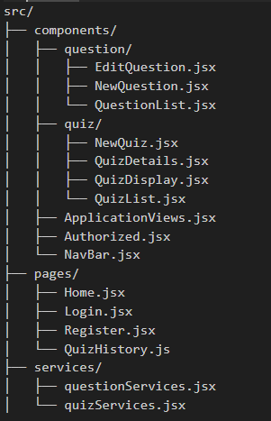

# BrainByte Client

A React-based frontend for BrainByte, an interactive quiz application designed for web developers to test and improve their knowledge.


## BrainByte API Link:
https://github.com/EditaAdomaityte/BrainByte-api


## Features
<p></p>
• Category Selection: Choose from various web development categories
• Quiz Customization: Select the number of questions you want to answer
• Interactive Quiz Interface: Answering true/false questions with an intuitive UI
• Results Display: Detailed quiz results showing correct and incorrect answers
• Quiz History: View a list of all quizzes you've taken
• Contribution System: Submit your own questions to help grow the platform
• Question Management: Edit and delete questions you've contributed
</p>

## Wireframe

Take a few minutes to check out the https://miro.com/app/board/uXjVI-z4a7Q=/?moveToWidget=3458764613778253888&cot=14

### ERD


## Installation

1. ### Prerequisites
Before you begin, ensure you have the following installed:

Node.js (v14.0.0 or higher):
https://nodejs.org/en/download

2. ### Clone the repository
In your terminal run:
```sh
git clone git@github.com:EditaAdomaityte/BrainByte-client.git
cd BrainByte-client
```

3. ### Install dependencies
npm (v6.0.0 or higher) 
In your terminal run:
```sh
npm install
```

4. ### Start the development server
In your terminal run:
```sh
npm start
```
The application will be available at URL provided in your terminal!

## Project Structure



## Usage

1. ### Creating an account.
  Create an account or Log in if account is already created.
  
2. ### Taking a Quiz
<p>
• Navigate to the 'Start quiz' in Nav Bar
• Select a category from the dropdown menu
• Choose the number of questions you want to answer
• Click "Start Quiz"
• Answer the true/false questions
• Submit your answers to see your results
</p>

3. ### Viewing Quiz History
<p>
• Navigate to the "My Results" section
• View a list of all quizzes you've taken
• Click on any quiz to see detailed results
</p>

4. ### Contributing Questions
<p>
• Navigate to the "Contribute" section
• Fill out the form with your question details
• Submit the question
</p>
5. ### Managing Your Questions
<p>
• Navigate to the "My Questions" section
• View all questions you've contributed
• Edit or delete questions as needed
</p>

## Contributing
<p> 
• Fork the repository
• Create your feature branch (git checkout -b feature/amazing-feature)
• Commit your changes (git commit -m 'Add some amazing feature')
• Push to the branch (git push origin feature/amazing-feature)
• Open a Pull Request
</p>

## Technologies Used

       

#### Created by Edita Adomaityte

<a href="https://github.com/EditaAdomaityte" target="_blank"></a> <a href="https://linkedin.com/in/edita-adomaityte" target="_blank"></a>
