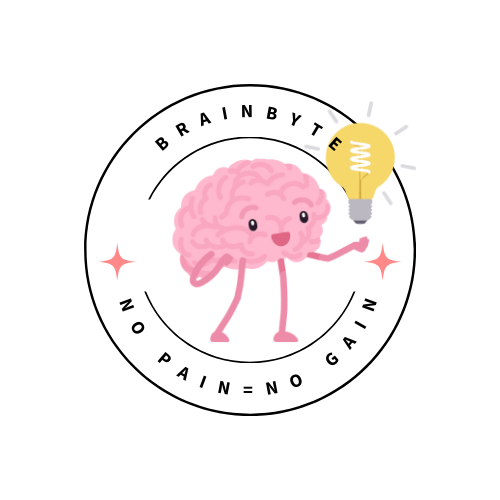
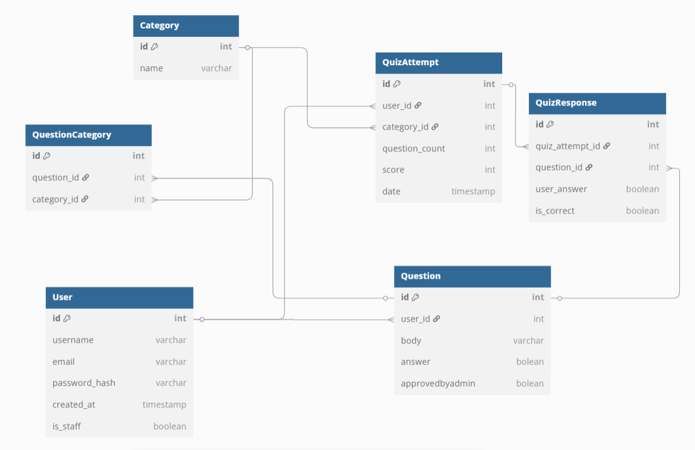

#BrainByte Client

A React-based frontend for BrainByte, an interactive quiz application designed for web developers to test and improve their knowledge.

##BrainByte API Link:
https://github.com/EditaAdomaityte/BrainByte-api

##Features

Category Selection: Choose from various web development categories
Quiz Customization: Select the number of questions you want to answer
Interactive Quiz Interface: Answering true/false questions with an intuitive UI
Results Display: Detailed quiz results showing correct and incorrect answers
Quiz History: View a list of all quizzes you've taken
Contribution System: Submit your own questions to help grow the platform
Question Management: Edit and delete questions you've contributed

## Wireframe

Take a few minutes to check out the https://miro.com/app/board/uXjVI-z4a7Q=/?moveToWidget=3458764613778253888&cot=14

### ERD

##Technologies Used

React.js
React Router for navigation
CSS/Bulma for styling

Prerequisites
Before you begin, ensure you have the following installed:

Node.js (v14.0.0 or higher) https://nodejs.org/en/download
npm (v6.0.0 or higher)

##Installation

###Prerequisites
Before you begin, ensure you have the following installed:

Node.js (v14.0.0 or higher):
https://nodejs.org/en/download

npm (v6.0.0 or higher) 
run npm install in your terminal 

###Clone the repository
git clone git@github.com:EditaAdomaityte/BrainByte-client.git
cd BrainByte-client

###Install dependencies
npm (v6.0.0 or higher) 
run npm install in your terminal 

###Start the development server
run npm start in your terminal 

The application will be available at URL provided in your terminal!

##Project Structure
src/
├── components/         
│   ├── question/
│   │   ├── EditQuestion.jsx
│   │   ├── NewQuestion.jsx
│   │   └── QuestionList.jsx
│   ├── quiz/
│   │   ├── NewQuiz.jsx
│   │   ├── QuizDetails.jsx
│   │   ├── QuizDisplay.jsx
│   │   └── QuizList.jsx
│   ├── ApplicationViews.jsx
│   ├── Authorized.jsx
│   └── NavBar.jsx
├── pages/             
│   ├── Home.jsx
│   ├── Login.jsx
│   ├── Register.jsx
│   └── QuizHistory.js
├── services/       
│   ├── questionServices.jsx
│   └── quizServices.jsx

##Usage

1. ###Create an account.
2. ###Taking a Quiz

Navigate to the 'Start quiz' in Nav Bar
Select a category from the dropdown menu
Choose the number of questions you want to answer
Click "Start Quiz"
Answer the true/false questions
Submit your answers to see your results

3. ###Viewing Quiz History

Navigate to the "My Results" section
View a list of all quizzes you've taken
Click on any quiz to see detailed results

4. ###Contributing Questions

Navigate to the "Contribute" section
Fill out the form with your question details
Submit the question

5. ###Managing Your Questions

Navigate to the "My Questions" section
View all questions you've contributed
Edit or delete questions as needed

API Integration
The frontend communicates with the Django backend through RESTful API endpoints:

##Contributing

Fork the repository
Create your feature branch (git checkout -b feature/amazing-feature)
Commit your changes (git commit -m 'Add some amazing feature')
Push to the branch (git push origin feature/amazing-feature)
Open a Pull Request

#### Created by Edita Adomaityte

 